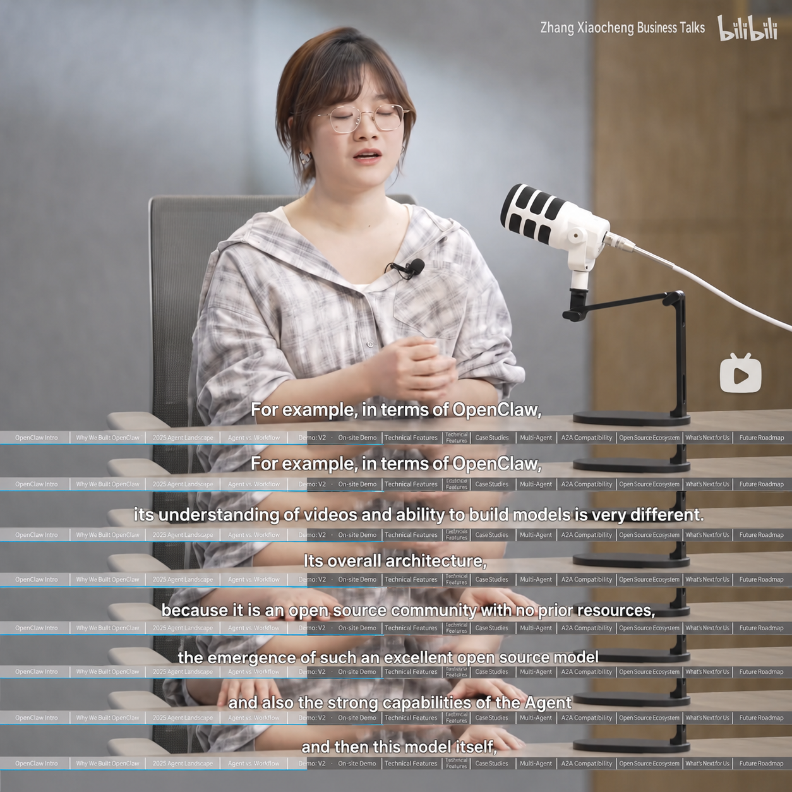
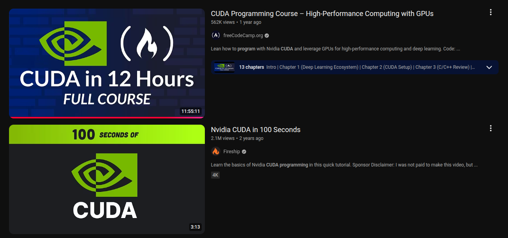
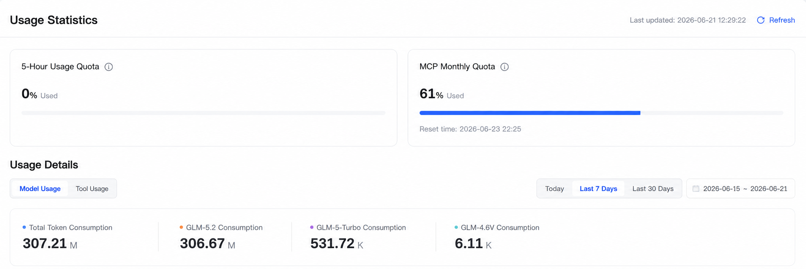
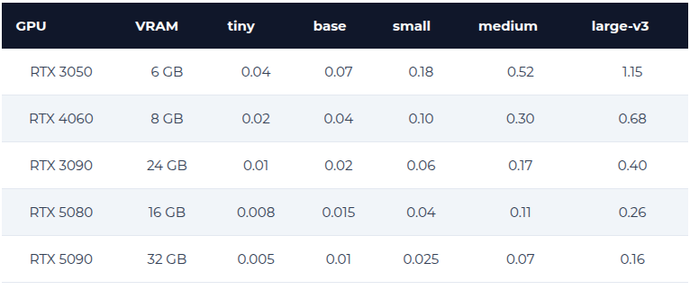
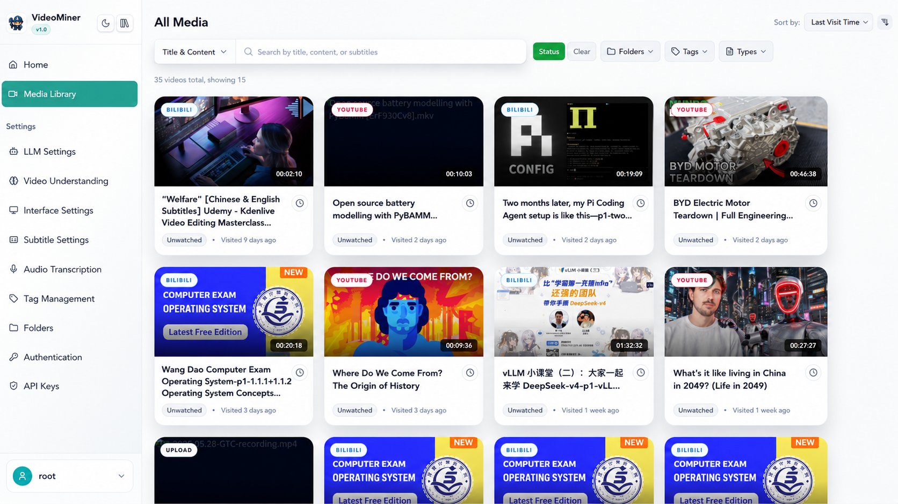
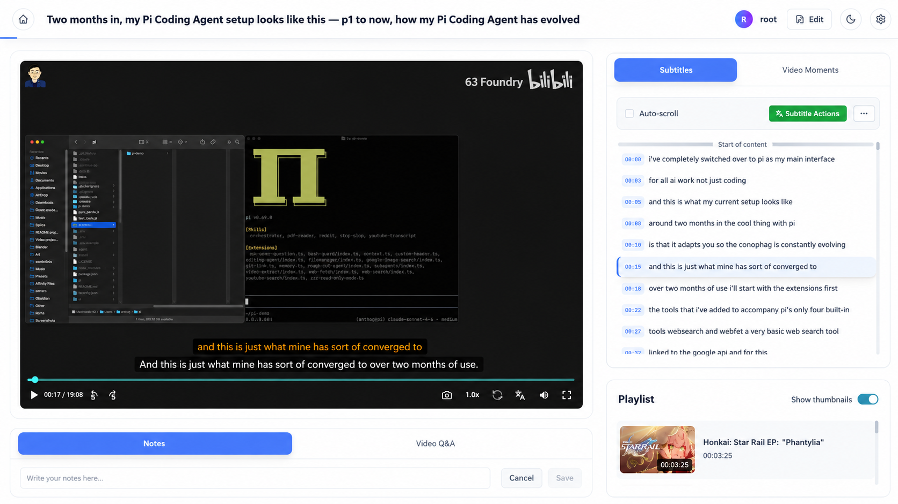
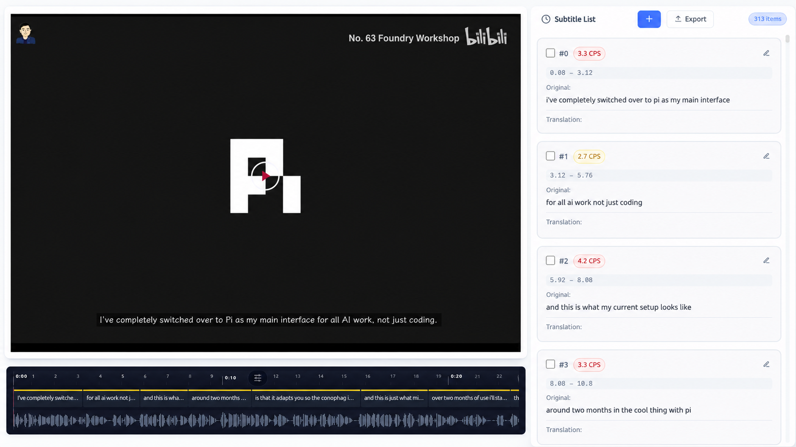
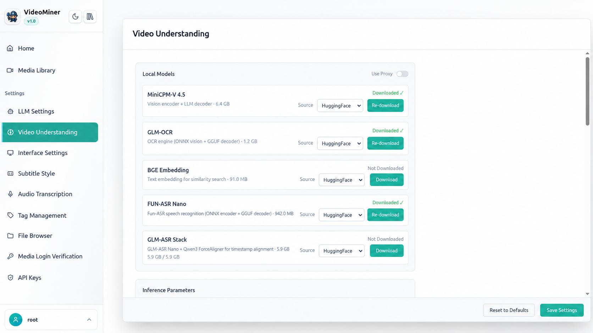

<p align="center">
  
</p>

<h2 align="center">VideoMiner</h2>

<p align="center">
  A Cloud-Edge Synergy Video-parsing System<br>
  一个本地-云端协同的视频解析框架
</p>

<p align="center">
  
  
  
</p>

---

## Motivation

Luo Fuli, head of Xiaomi's MiMo LLM team, mentioned in an interview that OpenClaw's audio-video understanding capability is weak, which is why their lab open-sourced the omni-modal model MiMo v2.5.

<p align="center">
  
</p>

In our daily work:
- We want to record a screen and have AI summarize what we did.
- When watching code walkthrough videos — whether traditional web dev or cutting-edge CUDA kernels — we want to generate a summary with the actual code extracted,and ask questions based on the summaries.

<p align="center">
  
</p>

---

However, relying purely on large LLMs for video understanding has two hard blockers:

1. **Prohibitively expensive.** Even the most cost-effective plans with no weekly limits (e.g., Zhipu AI's legacy tier) can't sustain it.

<p align="center">
  
</p>

2. **Real-time factor < 1.** An LLM takes more than 30 seconds to answer a question about a 30-second video. For 1-2 hour or even 11-hour videos, a pure-LLM approach is simply impractical.

The second problem is ASR throughput: the popular Faster-Whisper achieves only ~10x RTFx in practice. Tweaking batch size or upgrading from a 4060 Ti to a 5070 Ti makes no difference. But on consumer GPUs, combining KV Cache, Paged Attention, and Flash Attention tuning, this rate can reach **540+ RTFx** — **50× faster** than Faster-Whisper.

<p align="center">
  
</p>

This is exactly the problem VideoMiner solves.

---

## Features

VideoMiner's core idea is **cloud-edge synergy**: the local GPU handles the expensive audio/video decoding (ASR, OCR, VLM), while the cloud LLM only processes lightweight text-level tasks (summarization, translation, sentence splitting). This avoids the high cost and latency of sending raw video to a cloud LLM, while still leveraging its language understanding.

### Ultra-Fast Transcription Engine

- **GLM-ASR Stack**: Built on GLM-ASR-Nano + Qwen3 ForceAligner, with KV Cache, Paged Attention, and Flash Attention tuning. Achieves **540+ RTFx** on consumer GPUs (~50× Faster-Whisper). A 1-hour video takes only ~15-20 seconds for transcription + forced alignment.
- **Fun-ASR-GGUF**: Quantized Fun-ASR for broad compatibility. Supports hotword guidance and switchable VAD backends (Silero / FireRed).
- **ElevenLabs Scribe**: Cloud API alternative for environments without a GPU.

### Local Video Understanding

Instead of sending video to a cloud LLM, the entire pipeline runs locally:

1. **Frame Sampling**: Samples key frames based on Thinking Budget (Low / Medium / High)
2. **OCR Extraction**: GLM-OCR recognizes text in frames
3. **Corner Detection**: A cloud VLM (Gemini / MiMo-V2.5, etc.) detects slide boundaries; cropped frames are sent back to OCR for improved accuracy on lecture videos
4. **Semantic Retrieval**: BGE Embedding builds a frame vector index
5. **Summary Orchestration**: Tool-Calling coordinates the above capabilities to generate a structured summary
6. **Knowledge Enrichment**: An optional Knowledge LLM adds background context and terminology explanations

### Smart Subtitle System

- **LLM Sentence Splitting**: Word-level ASR timestamps are re-segmented by an LLM for natural readability
- **Multi-Language Translation**: Independently configurable translation LLM provider, with proxy support, concurrency control, and plain-translation mode
- **Subtitle Editor**: Waveform visualization, real-time preview, dual-language subtitles, custom styling (font / color / shadow / stroke)
- **Hardcoded Subtitle Export**: Burn subtitles directly into video files

### Video Management

- Download from Bilibili, YouTube, Apple Podcasts, and more
- Hierarchical organization with Folders and Tags
- Batch operations: move, delete, merge, bulk subtitle generation
- Built-in player: chapter navigation, subtitle panel, dual-language toggle

### MCP Tool Integration

Built-in MCP Server lets AI agents (OpenCode, Pi Agent, Claude Desktop) query the video library, search content, fetch summaries, and manage tags and folders directly.

See [Using Video-Miner MCP in OpenCode](docs/en/api-token/index.md)

---

## Summary Examples

The following examples demonstrate VideoMiner's structured summaries for CUDA course lectures.

| Lecture | YouTube | English Summary |
|---------|---------|-----------------|
| **Lecture 5: Performance Considerations** | [▶ Watch](https://www.youtube.com/watch?v=x5trGVMKTdY) | [📄 View Summary](https://github.com/JazerJu/video-parsing/blob/main/summary_export_examples/lecture5-720p-en_summary.md) |
| **Lecture 8: 2D Convolution CUDA Implementation** | [▶ Watch](https://www.youtube.com/watch?v=mVGY1i8iYxs) | [📄 View Summary](https://github.com/JazerJu/video-parsing/blob/main/summary_export_examples/lecture-08-convolution_summary.md) |

---

## Interface Preview

### Media Library

Grid view organized by folders, tags, and collections, with batch operations and search.

<p align="center">
  
</p>

### Video Player

Integrated subtitle panel, chapter navigation, notes, and mind map.

<p align="center">
  
</p>

### Subtitle Editor

Waveform alignment, real-time preview, and style adjustment.

<p align="center">
  
</p>

### Settings Panel

8 tabs covering models, transcription engine, subtitle styling, media credentials, video understanding, API tokens, tags, and folder management.

<p align="center">
  
</p>

---

## Documentation

See [Documentation](docs/en/index.md)

---

## Docker Deployment

### Prerequisites

- Docker 24+
- NVIDIA driver + [nvidia-container-toolkit](https://docs.nvidia.com/datacenter/cloud-native/container-toolkit/install-guide.html)
- Recommended GPU VRAM ≥ 8GB

### Quick Start

```bash
git clone https://github.com/JazerJu/video-miner.git
cd video-miner
cp .env.example .env
mkdir -p data/{media,config,models}
touch data/videos.db
docker compose up -d
```

Open `http://localhost:8080` in your browser.

> Full deployment guide (GPU parameters, port config, data persistence, proxy, MCP service): [Docker Deployment](docs/en/deployment.md).
>
> Need to build from source? See [Build from Scratch](docs/en/build-from-scratch.md).

---

## Roadmap

NVIDIA's CUDA ecosystem is indeed easy to use, but consumer GPUs have skyrocketed in price — the 5090 is selling at nearly double MSRP.
My lab happens to have 8×910B and 8×310B Ascend clusters, so the next step is:

- [ ] Optimize the project for Ascend NPU

---

## Acknowledgments

1. [Fun-ASR-GGUF](https://github.com/HaujetZhao/Fun-ASR-GGUF) / [Fun-ASR](https://github.com/FunAudioLLM/Fun-ASR) — Fun-ASR model and ONNX + llama.cpp collaboration approach
2. [GLM-ASR](https://github.com/zai-org/GLM-ASR) / [GLM-OCR](https://github.com/zai-org/GLM-OCR) — GLM-ASR and GLM-OCR models
3. [MiniCPM-V](https://github.com/OpenBMB/MiniCPM-V) — Best high-FPS local video understanding model
