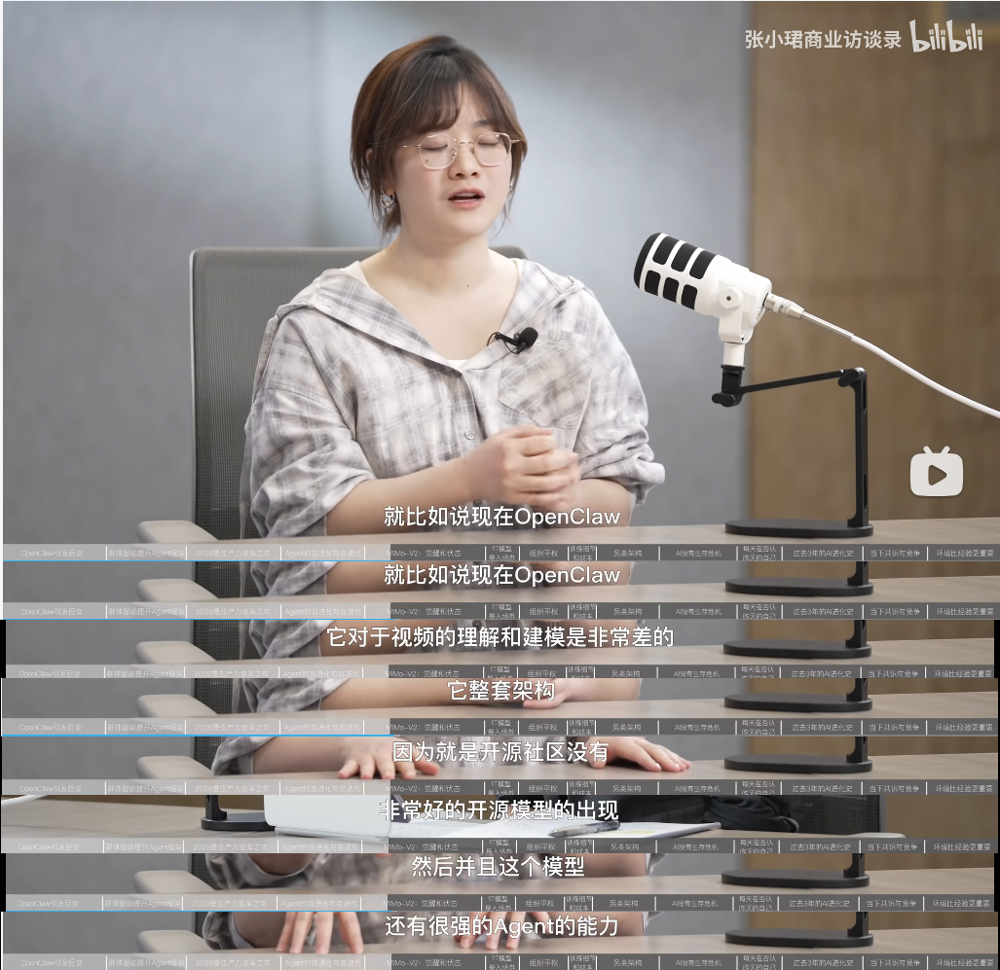
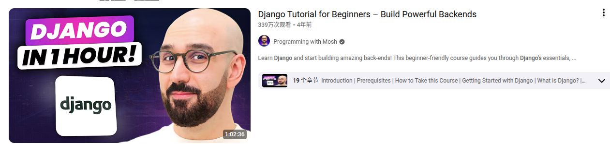
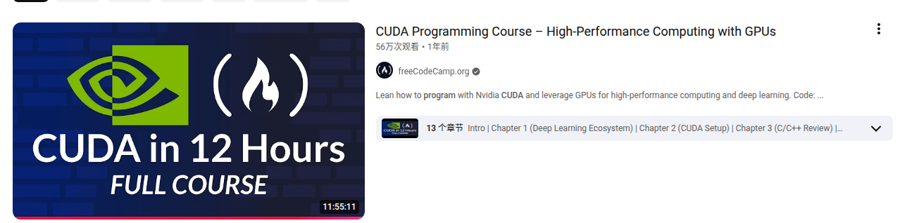
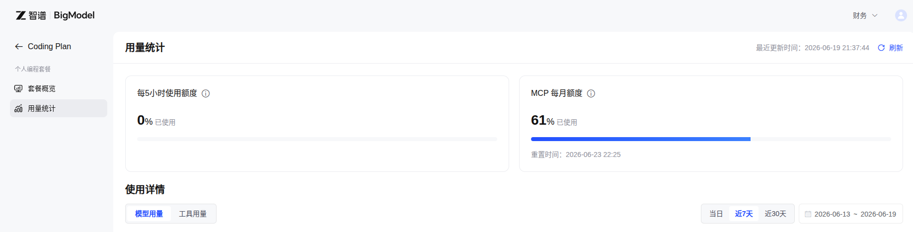
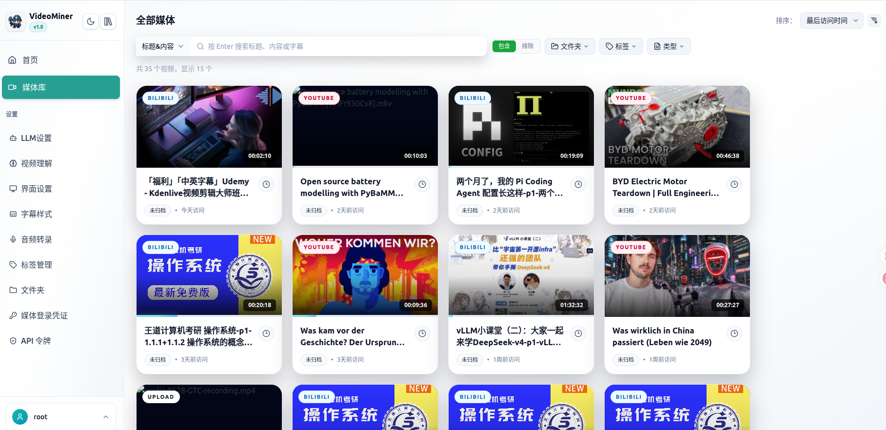
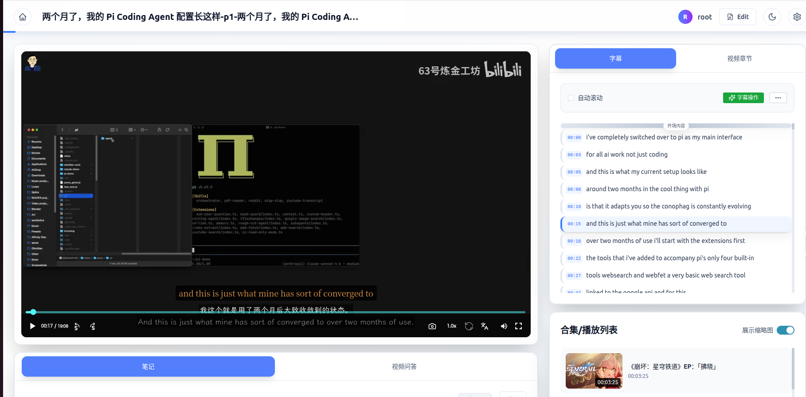
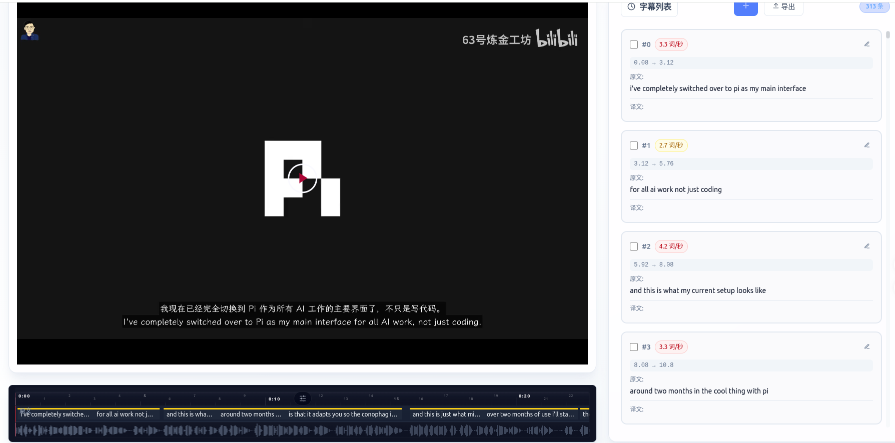
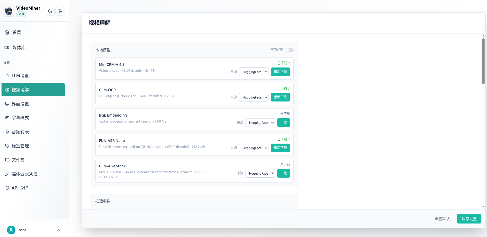

<p align="center">
  
</p>

<h2 align="center">VideoMiner</h2>

<p align="center">
  A Cloud-Edge Synergy Video-parsing System<br>
  一个本地-云端协同的视频解析框架
</p>

<p align="center">
  
  
  
</p>

---

## 引入

小米大模型 MiMo 的负责人罗福莉在接受访谈时提到，OpenClaw 的音视频理解能力很弱，因此实验室开源了全模态模型 MiMo v2.5。

<p align="center">
  
</p>

我们平时工作的时候：
- 希望录个屏，就能 AI 总结下自己的工作；
- 学习讲解代码的视频，无论是传统的 Web 还是新潮的 CUDA kernel，都希望可以直接生成包含具体代码的 summary。

<p align="center">
  
  
</p>

---

但是，纯粹依赖大模型理解视频存在两个硬伤：

1. **成本极高**。就算是性价比拉满、没有周限额的智谱 AI 老套餐也顶不住。

<p align="center">
  
</p>

2. **实时率 < 1**。大模型处理 30s 的视频提问需要超过 30s 才能回复。遇到 1-2h 甚至 11h 的视频，纯大模型方案根本不现实。

第二个问题是 ASR 效率：当前主流的 Faster-Whisper 实测只有 ~10x RTFx，调 batch_size、换显卡 4060Ti → 5070Ti 都一样。但在消费级 GPU 上，结合 KV Cache、Paged Attention 和 Flash Attention 调优，这一速率可以做到 **540+ RTFx**，是 Faster-Whisper 的 **50 倍**。

<p align="center">
  
</p>

这就是 VideoMiner 提供的解决方案。

---

## 功能介绍

VideoMiner 的核心思路是**本地-云端协同**：本地 GPU 负责昂贵的音频转录和视频理解（ASR、OCR、VLM），云端 LLM 只处理轻量的文本级任务（摘要、翻译、断句）。这样既绕开了大模型直接理解视频的高成本和低延迟，又保留了 LLM 的语言理解能力。

### 极速转录引擎

- **GLM-ASR Stack**：基于 GLM-ASR-Nano + Qwen3 ForceAligner，结合 KV Cache、Paged Attention 和 Flash Attention 调优，在消费级 GPU 上实现 **540+ RTFx**（约为 Faster-Whisper 的 50 倍）。一段 1 小时的视频，转录 + 强制对齐仅需约 15-20 秒。
- **Fun-ASR-GGUF**：基于 Fun-ASR 的量化版本，泛用性广，支持热词引导和 VAD 后端切换（Silero / FireRed）。
- **ElevenLabs Scribe**：云端 API 备选，适合没有 GPU 的场景。

### 本地视频理解

不把视频发给云端大模型，本地完成全流程：

1. **帧采样**：按 Thinking Budget 采样视频关键帧（Low / Medium / High）
2. **OCR 提取**：GLM-OCR 识别帧中文字
3. **角点检测**：云端 VLM（Gemini / MiMo-V2.5 等）检测幻灯片边界，裁切后再送 OCR，提升讲座类视频的识别准确率
4. **语义检索**：BGE Embedding 建立帧向量索引
5. **摘要编排**：通过 Tool-Calling 调度以上能力，生成结构化摘要
6. **知识补充**：可选的知识 LLM 补充背景信息和术语解释

### 智能字幕系统

- **LLM 断句**：ASR 输出的字级时间戳经 LLM 重新断句，阅读更自然
- **多语言翻译**：独立配置翻译 LLM 供应商，支持代理、并发控制、直译模式
- **字幕编辑器**：波形可视化、实时预览、双语字幕、样式自定义（字体 / 颜色 / 阴影 / 描边）
- **字幕嵌入导出**：支持将字幕烧录到视频中导出

### 视频管理

- 支持 Bilibili、YouTube、Apple Podcasts 等平台的视频下载
- 分类（Folders）、标签（Tags）分级管理
- 批量操作：移动、删除、合并、批量生成字幕
- 在线播放器：章节导航、字幕面板、双语切换

### MCP 工具集成

内置 MCP Server，AI Agent（如 OpenCode、Pi Agent、Claude Desktop）可以直接查询视频库、搜索内容、获取摘要、管理标签和分类。

详见 [在 OpenCode 中使用 Video-Miner MCP](docs/zh/api-token/index.md#在opencode中使用-video-miner-mcp)

---

## 摘要案例

以下案例展示了 VideoMiner 对 CUDA 课程视频生成的结构化摘要。

| 视频讲座 | YouTube | 中文摘要 |
|----------|---------|----------|
| **Lecture 5: Performance Considerations** | [▶ 观看](https://www.youtube.com/watch?v=x5trGVMKTdY) | [📄 查看摘要](https://github.com/JazerJu/video-parsing/blob/main/总结导出案例/lecture5-720p-en_summary/summary.md) |
| **Lecture 8: 2D Convolution CUDA Implementation** | [▶ 观看](https://www.youtube.com/watch?v=mVGY1i8iYxs) | [📄 查看摘要](https://github.com/JazerJu/video-parsing/blob/main/总结导出案例/lecture-08-convolution_summary/summary.md) |

---

## 界面预览

### 媒体库

分类 / 标签 / 合集组织的视频网格，支持批量操作和搜索。

<p align="center">
  
</p>

### 视频播放

集成字幕面板、章节导航、笔记和思维导图。

<p align="center">
  
</p>

### 字幕编辑器

波形对齐、实时预览、样式调整。

<p align="center">
  
</p>

### 设置面板

8 个标签页覆盖模型、转录引擎、字幕样式、媒体凭据、视频理解、API 令牌、标签和分类管理。

<p align="center">
  
</p>

---

## 帮助文档

见 [帮助文档](docs/zh/index.md)

---

## 使用 Docker 部署项目

### 前置要求

- Docker 24+
- NVIDIA 驱动 + [nvidia-container-toolkit](https://docs.nvidia.com/datacenter/cloud-native/container-toolkit/install-guide.html)
- 建议 GPU 显存 ≥ 8GB

### 快速开始

```bash
git clone https://github.com/JazerJu/video-miner.git
cd video-miner
cp .env.example .env
mkdir -p data/{media,config,models}
touch data/videos.db
docker compose up -d
```

访问 `http://localhost:8080` 即可使用。

> 完整部署文档（GPU 参数、端口配置、数据持久化、网络代理、MCP 服务）见 [Docker 部署](docs/zh/deployment.md)。
>
> 需要从源码编译镜像？见 [从零编译镜像](docs/zh/build-from-scratch.md)。

---

## 未来规划

英伟达的 CUDA 生态确实易用，但消费端显卡已经炒到天价，5090 的成交价几乎翻倍。
我所处的实验室正好有 8×910B 和 8×310B 的昇腾机群，接下来的工作是：

- [ ] 优化项目在昇腾 NPU 上的运行效率

---

## 致谢

1. [Fun-ASR-GGUF](https://github.com/HaujetZhao/Fun-ASR-GGUF) / [Fun-ASR](https://github.com/FunAudioLLM/Fun-ASR) — Fun-ASR 模型及 ONNX + llama.cpp 协作方案
2. [GLM-ASR](https://github.com/zai-org/GLM-ASR) / [GLM-OCR](https://github.com/zai-org/GLM-OCR) — GLM-ASR 与 GLM-OCR 模型
3. [MiniCPM-V](https://github.com/OpenBMB/MiniCPM-V) — 最佳高 FPS 本地视频理解模型
