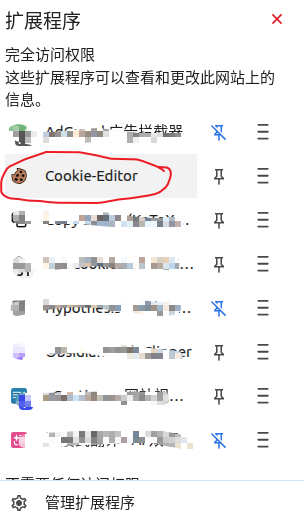
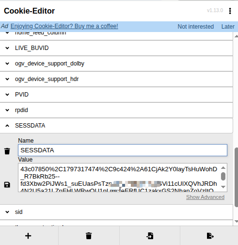
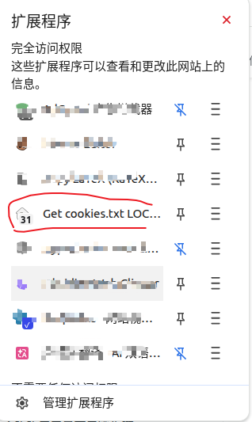
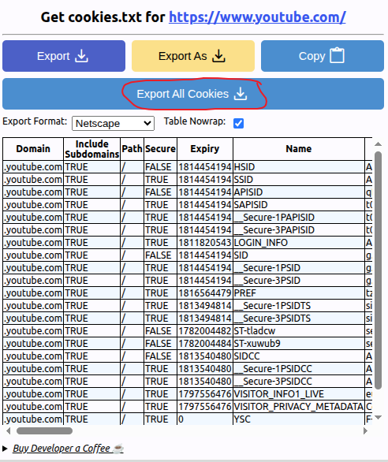

# Media Credentials

Media Credentials configure platform login data, browser cookies, the shared proxy, and yt-dlp dependency status. These settings affect Bilibili, YouTube, Podcast downloads, and LLM-related proxy switches.

## Bilibili credentials

| Setting | Type | Default | Description |
| --- | --- | --- | --- |
| Bilibili Login SESSDATA | Password input | Empty | Used to log in to Bilibili to get HD videos and subtitles. |
| Copy | Button | None | Copies the current SESSDATA value. |
| Save and validate | Button | None | Saves and validates the Bilibili session. A valid result can show account name, UID, and expiration time. |
| Login status | Status message | Not configured | Shows not configured, configured, valid, invalid, or expired. |

## YouTube cookies.txt

| Setting | Type | Default | Description |
| --- | --- | --- | --- |
| cookies.txt upload | File upload | Not uploaded | Uploads a browser-exported YouTube `cookies.txt` file for videos that require login. |
| Overwrite upload | File upload | None | If a cookies file already exists, uploading a new file replaces it. |
| File info | Hover tooltip | None | Shows modified time and file size. |

## Network Proxy Settings

| Setting | Type | Default | Description |
| --- | --- | --- | --- |
| Proxy Server Address | Text input | Empty | Shared proxy address, such as `http://host.docker.internal:7890`. Leave blank to disable proxy. |
| Use proxy for streaming downloads | Checkbox | Off | Sends YouTube and Podcast downloads through the proxy. |
| Use proxy for Bilibili downloads | Checkbox | Off | Sends Bilibili downloads through the proxy. |

> In Docker deployments, you can also configure the proxy through the `HTTPS_PROXY` environment variable, but the proxy address in the settings panel has higher priority and is used as the application-level shared proxy. If the proxy address is empty in the settings panel, the app uses the container deployment's `HTTPS_PROXY` by default.

## yt-dlp management

| Setting | Type | Default | Description |
| --- | --- | --- | --- |
| yt-dlp Version | Status display | Backend detected value | Shows the current yt-dlp version. |
| EJS Script | Status display | Backend detected value | Shows yt-dlp EJS support status. |
| Node.js Runtime | Status display | Backend detected value | Shows whether Node.js is available and its version. |
| Node Requirement | Status display | Backend detected value | Shows the required Node.js version. |
| Install yt-dlp dependencies | Button | None | Installs `yt-dlp[default]`, `yt-dlp-ejs`, `pycryptodomex`, `brotli`, and related dependencies. |
| Check and upgrade yt-dlp | Button | None | Checks the latest version and upgrades yt-dlp and dependencies. |
| Refresh Status | Button | None | Reloads yt-dlp management status. |

- yt-dlp decodes videos in two steps: it gets the script, then builds a browser-like environment for decryption. The second step requires a Node.js runtime and EJS script, preferably at the latest version.
- Because YouTube's environment detection script targets users only, requests without cookies can sometimes trigger anonymous access and download public resources successfully.

## How to get Bilibili SESSDATA

Method 1:

1. Log in to Bilibili in your browser.
2. Open the browser developer tools.
3. Find Bilibili cookies in the application or storage panel.
4. Copy the value named `SESSDATA`.
5. Paste it into the settings panel and click Save and validate.

Method 2: install the Cookies-Editor browser extension.

1. Log in to Bilibili in your browser.
2. Open the browser developer tools.
3. Open the extension, find the value named `SESSDATA`, and copy it.
4. Paste it into the settings panel and click Save and validate.

## How to prepare YouTube cookies.txt

1. Log in to YouTube in your browser.
2. Install the Get cookies.txt LOCALLY browser extension.
3. Open YouTube in the browser, use the extension, and export `cookies.txt`.
4. Upload the file in Media Credentials.

---

[Back to English docs](../) | [Previous: Transcription Engine](../transcription/) | [Next: API Token Management](../api-token/)
